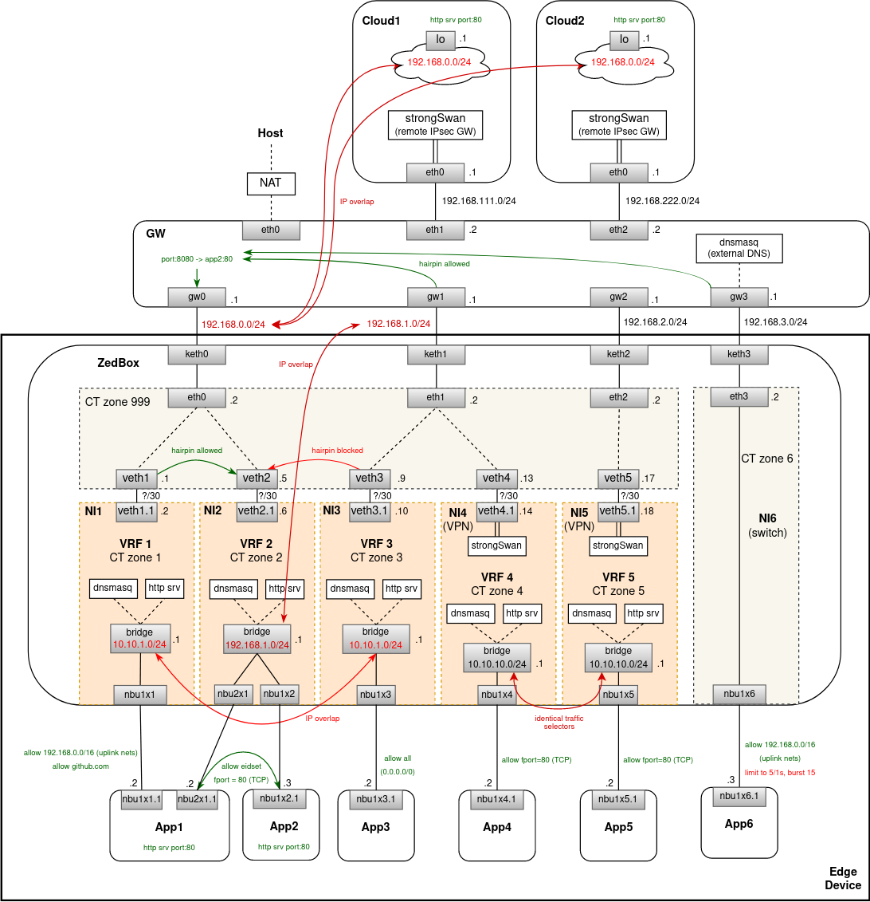

# Multi-VRF Proposal

## Diagram



## Source code

See `proposal/multi-vrf` sub-directory.

## Deploy & Test

Deploy simulation of the scenario with per-NI VRF:
```
$ make start-multi-vrf
```

Check that `app1` has been assigned IP addresses in both networks:
```
$ docker exec -it app1 bash
root@6ba02e9464c0:/# ip addr
1: lo: <LOOPBACK,UP,LOWER_UP> mtu 65536 qdisc noqueue state UNKNOWN group default qlen 1000
    link/loopback 00:00:00:00:00:00 brd 00:00:00:00:00:00
    inet 127.0.0.1/8 scope host lo
       valid_lft forever preferred_lft forever
2: nbu1x1.1@if5: <BROADCAST,MULTICAST,UP,LOWER_UP> mtu 1500 qdisc noqueue state UP group default qlen 1000
    link/ether c6:c5:7d:09:41:30 brd ff:ff:ff:ff:ff:ff link-netns ni1
    inet 10.10.1.66/24 brd 10.10.1.255 scope global dynamic nbu1x1.1
       valid_lft 3513sec preferred_lft 3513sec
4: nbu2x1.1@if5: <BROADCAST,MULTICAST,UP,LOWER_UP> mtu 1500 qdisc noqueue state UP group default qlen 1000
    link/ether e6:53:75:fc:3a:45 brd ff:ff:ff:ff:ff:ff link-netns ni2
    inet 192.168.1.64/24 brd 192.168.1.255 scope global dynamic nbu2x1.1
       valid_lft 3513sec preferred_lft 3513sec
```

Try `github.com` (should be ALLOWED) and `google.com` (should be BLOCKED) from `app1`:
```
$ docker exec -it app1 bash
root@6ba02e9464c0:/# curl --interface nbu1x1.1 github.com; echo $?
0
root@6ba02e9464c0:/# curl --interface nbu1x1.1 --connect-timeout 3 --retry 3  google.com
curl: (28) Connection timed out after 3000 milliseconds
Warning: Transient problem: timeout Will retry in 1 seconds. 3 retries left.
curl: (28) Connection timed out after 3000 milliseconds
Warning: Transient problem: timeout Will retry in 2 seconds. 2 retries left.
curl: (28) Connection timed out after 3000 milliseconds
Warning: Transient problem: timeout Will retry in 4 seconds. 1 retries left.
curl: (28) Connection timed out after 3000 milliseconds
```

Check conntracks for the allowed connection. Notice that there are two entries - one in the NI-specific CT zone and
the second one in the common `999` CT zone. Packet is being routed and NATed twice:
```
$ docker exec -it ni1 bash
root@559d039a1383:/# conntrack -L
tcp      6 118 TIME_WAIT src=10.10.1.53 dst=140.82.121.4 sport=40486 dport=80 src=140.82.121.4 dst=169.254.100.2 sport=80 dport=40486 [ASSURED] mark=16777217 zone=1 use=1
tcp      6 118 TIME_WAIT src=169.254.100.2 dst=140.82.121.4 sport=40486 dport=80 src=140.82.121.4 dst=192.168.0.2 sport=80 dport=40486 [ASSURED] mark=0 zone=999 use=1
```

Check that conntrack was created even for dropped connections (in the NI-specific CT zone only where the packet ended at the dummy interface):
```
$ docker exec -it ni1 bash
root@559d039a1383:/# conntrack -L
tcp      6 118 SYN_SENT src=10.10.1.53 dst=216.58.212.174 sport=56562 dport=80 [UNREPLIED] src=216.58.212.174 dst=10.10.1.53 sport=80 dport=56562 mark=33554431 zone=1 use=1
...
```

Check that `app1` can access `app2` in the shared network `ni2`:
```
$ docker exec -it app1 bash
root@6ba02e9464c0:/# curl --interface nbu2x1.1 app2; echo $?
...
0
```

Note that `eidset` was applied in this case:
```
$ docker exec -it ni2 bash
root@99669d7cb66c:/# iptables -L -v -t mangle
Chain PREROUTING (policy ACCEPT 0 packets, 0 bytes)
 pkts bytes target     prot opt in     out     source               destination
  ...         
   144  7564 nbu2x1-1   tcp  --  br2    any     anywhere             anywhere             PHYSDEV match --physdev-in nbu2x1+ match-set ipv4.eids.nbu2x1 dst tcp dpt:http
  ...
```

Conntrack is created even in this case (NI-zone only, zone `999` is not traversed here):
```
$ docker exec -it ni2 bash
root@99669d7cb66c:/# conntrack -L
tcp      6 115 TIME_WAIT src=192.168.1.113 dst=192.168.1.135 sport=40380 dport=80 src=192.168.1.135 dst=192.168.1.113 sport=80 dport=40380 [ASSURED] mark=16777217 zone=2 use=1
```

Try to hairpin from `app1` to `app2` via portmap inside the zedbox (via zone `999`):
```
$ docker exec -it app1 bash
root@8d44d3f125e1:/# curl --interface nbu1x1.1 192.168.0.2:8080
...
```

There will 3 conntracks for this hairpin - one for `NI1` zone, another for `NI2` zone and finally one for `999` where
DNAT occurred:
```
root@6485105f733a:/# conntrack -L
tcp      6 118 TIME_WAIT src=10.10.1.53 dst=192.168.0.2 sport=55096 dport=8080 src=192.168.0.2 dst=169.254.100.2 sport=8080 dport=55096 [ASSURED] mark=16777218 zone=1 use=1
tcp      6 118 TIME_WAIT src=169.254.100.2 dst=192.168.0.2 sport=55096 dport=8080 src=169.254.100.6 dst=169.254.100.2 sport=8080 dport=55096 [ASSURED] mark=0 zone=999 use=1
tcp      6 118 TIME_WAIT src=169.254.100.2 dst=169.254.100.6 sport=55096 dport=8080 src=192.168.1.135 dst=169.254.100.2 sport=80 dport=55096 [ASSURED] mark=33554434 zone=2 use=1
```

Try to hairpin from `app1` to `app2` via portmap in the `NI2` namespace:
```
$ docker exec -it app1 bash
root@8d44d3f125e1:/# ip route del default
root@8d44d3f125e1:/# ip route add default via 192.168.1.1 dev nbu2x1.1
root@8d44d3f125e1:/# curl 192.168.0.2:8080
<BLOCKED>
```
**TODO**: this is blocked - there is no ACE for `app1` allowing this in `NI2`.\
Or should this be implicitly allowed? Currently, EVE is inconsistent here.

Try to access mock HTTP server with cloud-init metadata from `app1`:
```
$ docker exec -it app1 bash
root@8d44d3f125e1:/# curl 169.254.169.254; echo $?
...
0
```

Try to access `app1` & `github.com` from `app2` (should be allowed & blocked, respectively):
```
$ docker exec -it app2 bash
root@c956a4d1c24d:/# curl app1; echo $?
...
0
root@c956a4d1c24d:/# curl --connect-timeout 3 --retry 3  github.com
curl: (28) Connection timed out after 3000 milliseconds
Warning: Transient problem: timeout Will retry in 1 seconds. 3 retries left.
curl: (28) Connection timed out after 3001 milliseconds
Warning: Transient problem: timeout Will retry in 2 seconds. 2 retries left.
curl: (28) Connection timed out after 3001 milliseconds
Warning: Transient problem: timeout Will retry in 4 seconds. 1 retries left.
curl: (28) Connection timed out after 3001 milliseconds
```

Try any website from `app3` (all should be ALLOWED):
```
$ docker exec -it app3 bash
root@604474ae312b:/# curl zededa.com; echo $?
<html>
<head><title>301 Moved Permanently</title></head>
<body>
<center><h1>301 Moved Permanently</h1></center>
<hr><center>nginx</center>
</body>
</html>
0
```

Try to hairpin from `app3` to `app2` via portmap outside the edge device (verify with `docker exec -it gw tcpdump -i any -n`):
```
$ docker exec -it app3 bash
root@8d44d3df421:/# curl 192.168.0.2:8080; echo $?
...
0
```
*Note*: in this case the traffic is SNATed as it is leaving default VRF and entering the NI2 VRF, otherwise there would be
an IP address collision (between the source IP address and the NI2 subnet) - notice `... src=169.254.100.6 dst=169.254.100.5 ...`.

As expected there are 4 conntracks in total for this communication inside the zedbox namespace:
```
tcp      6 104 TIME_WAIT src=10.10.1.94 dst=192.168.0.2 sport=48944 dport=8080 src=192.168.0.2 dst=169.254.100.10 sport=8080 dport=48944 [ASSURED] mark=50331649 zone=3 use=1
tcp      6 104 TIME_WAIT src=169.254.100.10 dst=192.168.0.2 sport=48944 dport=8080 src=192.168.0.2 dst=192.168.1.2 sport=8080 dport=48944 [ASSURED] mark=0 zone=999 use=1
tcp      6 104 TIME_WAIT src=192.168.1.2 dst=192.168.0.2 sport=48944 dport=8080 src=169.254.100.6 dst=169.254.100.5 sport=8080 dport=48944 [ASSURED] mark=0 zone=999 use=1
tcp      6 104 TIME_WAIT src=169.254.100.5 dst=169.254.100.6 sport=48944 dport=8080 src=192.168.1.135 dst=169.254.100.5 sport=80 dport=48944 [ASSURED] mark=33554434 zone=2 use=1
```

Try to hairpin from `app4` to `app2` via portmap outside the edge device:
```
$ docker exec -it app4 bash
root@8d44d3df421:/# curl 192.168.0.2:8080
(WORKS AND IT IS LIMITED IN BANDWIDTH)
```

In this case, there are 3 conntracks inside the zedbox namespace - switch network does not use the `999` zone (but portmap does):
```
tcp      6 299 ESTABLISHED src=192.168.2.86 dst=192.168.0.2 sport=33594 dport=8080 src=192.168.0.2 dst=192.168.2.86 sport=8080 dport=33594 [ASSURED] mark=67108865 zone=4 use=1
tcp      6 299 ESTABLISHED src=192.168.2.86 dst=192.168.0.2 sport=33594 dport=8080 src=169.254.100.6 dst=192.168.2.86 sport=8080 dport=33594 [ASSURED] mark=0 zone=999 use=1
tcp      6 299 ESTABLISHED src=192.168.2.86 dst=169.254.100.6 sport=33594 dport=8080 src=192.168.1.135 dst=192.168.2.86 sport=80 dport=33594 [ASSURED] mark=33554434 zone=2 use=1
```

Try any remote destination from `app4`. Should be blocked and leave no conntracks:
```
$ docker exec -it app4 bash
root@6ba02e9464c0:/# curl --connect-timeout 3 --retry 3  google.com
curl: (28) Connection timed out after 3000 milliseconds
Warning: Transient problem: timeout Will retry in 1 seconds. 3 retries left.
curl: (28) Connection timed out after 3000 milliseconds
Warning: Transient problem: timeout Will retry in 2 seconds. 2 retries left.
curl: (28) Connection timed out after 3000 milliseconds
Warning: Transient problem: timeout Will retry in 4 seconds. 1 retries left.
curl: (28) Connection timed out after 3000 milliseconds
```

Try to connect from `zedbox` to `app1` (i.e. the case of EVE initiating connection with an app):
```
$ docker exec -it zedbox bash
root@8d44d3df421:/# curl --interface veth1 10.10.1.102:80
...
```
Note that IP address assigned to `app1` may be different for your deployment - get IP with `docker exec app1 ifconfig nbu1x1.1`.\
**TODO**: DNS service for the default VRF with app host entries?

Two conntracks expected in this case:
```
tcp      6 117 TIME_WAIT src=169.254.100.1 dst=10.10.1.53 sport=51096 dport=80 src=10.10.1.53 dst=169.254.100.1 sport=80 dport=51096 [ASSURED] mark=0 zone=999 use=1
tcp      6 117 TIME_WAIT src=169.254.100.1 dst=10.10.1.53 sport=51096 dport=80 src=10.10.1.53 dst=169.254.100.1 sport=80 dport=51096 [ASSURED] mark=10 zone=1 use=1
```

Try to connect to `app2` from outside over the portmap:
```
$ docker exec -it gw bash
root@4cb6b997b2be:/# curl 192.168.0.2:8080; echo $?
...
0
```

Finally, undeploy simulation with:
```
$ make stop-multi-vrf
```
