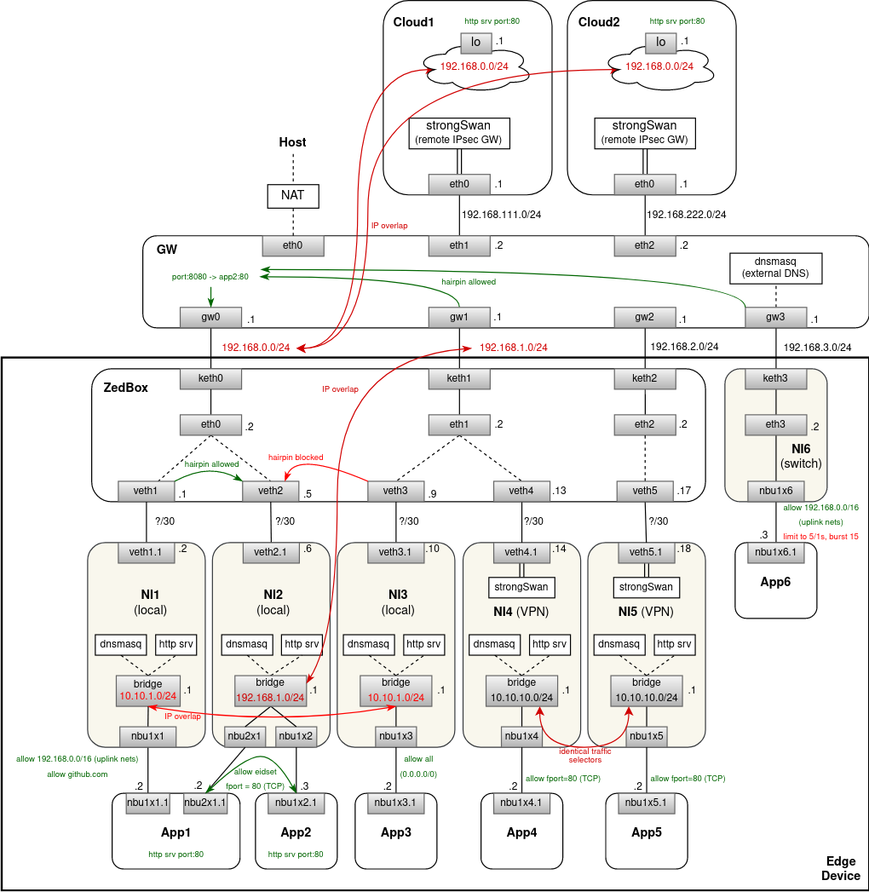

# EVE networking experiments

This private repo is used to test new network configurations for [EVE OS](https://github.com/lf-edge/eve)
using docker containers to simulate different network stacks and CLI tools to make configuration changes.
To purpose is to quickly and easily validate proposed network configuration changes before commencing any
implementation work in the EVE repository.

Developed and tested on Ubuntu 20.04.

## Scenario

The EdgeDevice JSON configuration corresponding to this scenario can be found [here](./scenario.json).\
This is the simplest scenario I could think of that covers all important aspects of networking in EVE OS:

- edge device has 3 uplink interfaces: `eth0`, `eth1`, `eth2`
- 4 network instances are created:
    - local network `NI1`, using `eth0` as uplink (at the moment which is being simulated here)
    - local network `NI2`, also using `eth0` as uplink
    - local network `NI3`, using `eth1` as uplink
    - switch network `NI4`, bridged with `eth2`
- 4 applications are deployed:
    - `app1` connected to `NI1` and `NI2`
        - it runs HTTP server on the local port `80`
    - `app2` connected to `NI2`
        - it runs HTTP server on the local port `80`
    - `app3` connected to `NI3`
    - `app4` connected to `NI4`
- there is a `GW` container simulating the router to which the edge device is connected
    - for simplicity, in this simulation all uplinks are connected to the same router
    - `GW` runs dnsmasq as a DNS+DHCP service for the interface used by the switch network `NI4`
        - i.e. this is the DHCP server that will allocate IP address for `app4`
    - `GW` container is connected to the host via docker bridge with NAT
        - this gives apps the access to the Internet
- there is `zedbox` container representing the default network namespace of EVE OS
    - in multi-ns proposal there is also one container per local network instance
- the simulated ACLs are configured as follows:
    - `app1`:
        - able to access `*github.com`
        - able to access `app2` http server:
            - either directly via `NI2` (`eidset` rule with `fport=80`)
            - or hairpinning: `NI1` -> `zedbox` namespace (using portmap) -> `NI2`
                - i.e. without leaving the edge node (note that this should be allowed because `NI1` an `NI2` use the same uplink)
                - not sure what the `ACCEPT` ACE should look like in this case - statically configured uplink subnet(s)?
    - `app2`:
        - http server is exposed on the uplink IP and port `8080`
        - is able to access `eidset`/`fport=80` - which means it can talk to `app1` http server
    - `app3`:
        - is able to communicate with any IPv4 endpoint
    - `app4`:
        - is able to access `app2` by hairpinning outside the box
            - this is however limited to 5 packets per second with bursts up to 15 packets
- IP subnets of `NI1` and `NI3` are identical (separation via namespaces or VRFs is necessary)
- IP subnets of `NI2` and that of the uplink `eth1` are identical (separation via namespaces or VRFs is necessary)

## Multi-NS Proposal

### Diagram



### Deploy & Test

Deploy simulation of the scenario with per-NI network namespaces:
```
$ make start-multi-ns
```

Check that `app1` has been assigned IP addresses in both networks:
```
$ docker exec -it app1 bash
root@6ba02e9464c0:/# ip addr
1: lo: <LOOPBACK,UP,LOWER_UP> mtu 65536 qdisc noqueue state UNKNOWN group default qlen 1000
    link/loopback 00:00:00:00:00:00 brd 00:00:00:00:00:00
    inet 127.0.0.1/8 scope host lo
       valid_lft forever preferred_lft forever
2: nbu1x1.1@if5: <BROADCAST,MULTICAST,UP,LOWER_UP> mtu 1500 qdisc noqueue state UP group default qlen 1000
    link/ether c6:c5:7d:09:41:30 brd ff:ff:ff:ff:ff:ff link-netns ni1
    inet 10.10.1.66/24 brd 10.10.1.255 scope global dynamic nbu1x1.1
       valid_lft 3513sec preferred_lft 3513sec
4: nbu2x1.1@if5: <BROADCAST,MULTICAST,UP,LOWER_UP> mtu 1500 qdisc noqueue state UP group default qlen 1000
    link/ether e6:53:75:fc:3a:45 brd ff:ff:ff:ff:ff:ff link-netns ni2
    inet 192.168.1.64/24 brd 192.168.1.255 scope global dynamic nbu2x1.1
       valid_lft 3513sec preferred_lft 3513sec
```

Try `github.com` (should be ALLOWED) and `google.com` (should be BLOCKED) from `app1`:
```
$ docker exec -it app1 bash
root@6ba02e9464c0:/# curl github.com; echo $?
0
root@6ba02e9464c0:/# curl --interface nbu1x1.1 --connect-timeout 3 --retry 3  google.com
curl: (28) Connection timed out after 3000 milliseconds
Warning: Transient problem: timeout Will retry in 1 seconds. 3 retries left.
curl: (28) Connection timed out after 3000 milliseconds
Warning: Transient problem: timeout Will retry in 2 seconds. 2 retries left.
curl: (28) Connection timed out after 3000 milliseconds
Warning: Transient problem: timeout Will retry in 4 seconds. 1 retries left.
curl: (28) Connection timed out after 3000 milliseconds
```

Check conntracks for the allowed connection (also notice that SNAT on the veth interface is being used here):
```
$ docker exec -it ni1 bash
root@559d039a1383:/# conntrack -L
udp      17 28 src=10.10.1.66 dst=10.10.1.1 sport=57252 dport=53 src=10.10.1.1 dst=10.10.1.66 sport=53 dport=57252 [ASSURED] mark=6 use=1
tcp      6 118 TIME_WAIT src=10.10.1.66 dst=140.82.121.3 sport=58508 dport=80 src=140.82.121.3 dst=1.1.1.2 sport=80 dport=58508 [ASSURED] mark=16777217 use=1
udp      17 28 src=1.1.1.2 dst=8.8.8.8 sport=18901 dport=53 src=8.8.8.8 dst=1.1.1.2 sport=53 dport=18901 mark=0 use=1
```

Check that conntracks were created even for dropped connections:
```
$ docker exec -it ni1 bash
root@559d039a1383:/# conntrack -L
tcp      6 104 SYN_SENT src=10.10.1.66 dst=142.250.181.238 sport=44226 dport=80 [UNREPLIED] src=142.250.181.238 dst=10.10.1.66 sport=80 dport=44226 mark=33554431 use=1
...
```

Check that `app1` can access `app2` in the shared network `ni2`:
```
$ docker exec -it app1 bash
root@6ba02e9464c0:/# curl --interface nbu2x1.1 app2; echo $?
...
0
```

Note that `eidset` was applied in this case:
```
$ docker exec -it ni2 bash
root@99669d7cb66c:/# iptables -L -v -t mangle
Chain PREROUTING (policy ACCEPT 0 packets, 0 bytes)
 pkts bytes target     prot opt in     out     source               destination
  ...         
   43  2320 nbu2x1-1   tcp  --  br     any     anywhere             anywhere             PHYSDEV match --physdev-in nbu2x1+ match-set ipv4.eids.nbu2x1 dst tcp dpt:http
  ...
```

Conntrack is created even in this case:
```
$ docker exec -it ni2 bash
root@99669d7cb66c:/# conntrack -L
tcp      6 8 CLOSE src=192.168.1.149 dst=192.168.1.67 sport=50972 dport=80 src=192.168.1.67 dst=192.168.1.149 sport=80 dport=50972 [ASSURED] mark=16777217 use=1
```

Try to hairpin from `app1` to `app2` via portmap in the zedbox namespace:
```
$ docker exec -it app1 bash
root@8d44d3f125e1:/# curl --interface nbu1x1.1 192.168.0.2:8080
...
```

Try to hairpin from `app1` to `app2` via portmap in the `NI2` namespace:
```
$ docker exec -it app1 bash
root@8d44d3f125e1:/# ip route del default
root@8d44d3f125e1:/# ip route add default via 192.168.1.1 dev nbu2x1.1
root@8d44d3f125e1:/# curl 192.168.0.2:8080
<BLOCKED>
```
**TODO**: this is blocked - there is no ACE for `app1` allowing this in `NI2`.
Or should this be implicitly allowed? Currently, EVE is inconsistent here.

Try to access mock HTTP server with cloud-init metadata from `app1`:
```
$ docker exec -it app1 bash
root@8d44d3f125e1:/# curl 169.254.169.254; echo $?
...
0
```

Try to access `app1` & github from `app2` (should be allowed & blocked, respectively):
```
$ docker exec -it app2 bash
root@c956a4d1c24d:/# curl app1; echo $?
...
0
root@c956a4d1c24d:/# curl --connect-timeout 3 --retry 3  github.com
curl: (28) Connection timed out after 3000 milliseconds
Warning: Transient problem: timeout Will retry in 1 seconds. 3 retries left.
curl: (28) Connection timed out after 3001 milliseconds
Warning: Transient problem: timeout Will retry in 2 seconds. 2 retries left.
curl: (28) Connection timed out after 3001 milliseconds
Warning: Transient problem: timeout Will retry in 4 seconds. 1 retries left.
curl: (28) Connection timed out after 3001 milliseconds
```

Try any website from `app3`:
```
$ docker exec -it app3 bash
root@604474ae312b:/# curl zededa.com; echo $?
<html>
<head><title>301 Moved Permanently</title></head>
<body>
<center><h1>301 Moved Permanently</h1></center>
<hr><center>nginx</center>
</body>
</html>
0
```

Try to hairpin from `app3` to `app2` via portmap outside the edge device:
```
$ docker exec -it app3 bash
root@8d44d3df421:/# curl 192.168.0.2:8080; echo $?
...
0
```
*Note*: in this case the traffic is SNATed when it is leaving zedbox NS and entering NI2 NS, otherwise there would
be IP address collision (between the source IP address and the NI2 subnet).

this scenario does not currently work due to the IP collision between the source uplink interface
and the destination network instance subnet (`192.168.1.0/24` in this simulation). We may need to SNAT traffic 
going from the zedbox namespace through veth into a NI namespace. But then we lose information about the original
sender, which is needed for proper flow-logging.

Try to hairpin from `app4` to `app2` via portmap outside the edge device:
```
$ docker exec -it app4 bash
root@8d44d3df421:/# curl 192.168.0.2:8080
(WORKS AND IT IS LIMITED IN BANDWIDTH)
```

Try any remote destination from `app4`. Should be blocked and leave no conntracks:
```
$ docker exec -it app4 bash
root@6ba02e9464c0:/# curl --connect-timeout 3 --retry 3  google.com
curl: (28) Connection timed out after 3000 milliseconds
Warning: Transient problem: timeout Will retry in 1 seconds. 3 retries left.
curl: (28) Connection timed out after 3000 milliseconds
Warning: Transient problem: timeout Will retry in 2 seconds. 2 retries left.
curl: (28) Connection timed out after 3000 milliseconds
Warning: Transient problem: timeout Will retry in 4 seconds. 1 retries left.
curl: (28) Connection timed out after 3000 milliseconds
```

Try to connect from `zedbox` to `app1` (i.e. the case of EVE initiating connection with an app):
```
$ docker exec -it zedbox bash
root@8d44d3df421:/# curl --interface veth1 10.10.1.102:80
...
```
Note that IP address assigned to `app1` may be different for your deployment.
**TODO**: DNS service for zedbox namespace with app host entries?

Try to connect to `app2` from outside over the portmap:
```
$ docker exec -it gw bash
root@4cb6b997b2be:/# curl 192.168.0.2:8080; echo $?
...
0
```

Finally, undeploy simulation with:
```
$ make stop-multi-ns
```

## Multi-VRF Proposal

### Diagram


### Deploy & Test

Deploy simulation of the scenario with per-NI VRF devices:
```
$ make start-multi-vrf
```

Test ... **TBD**

Undeploy simulation with:
```
$ make stop-multi-vrf
```